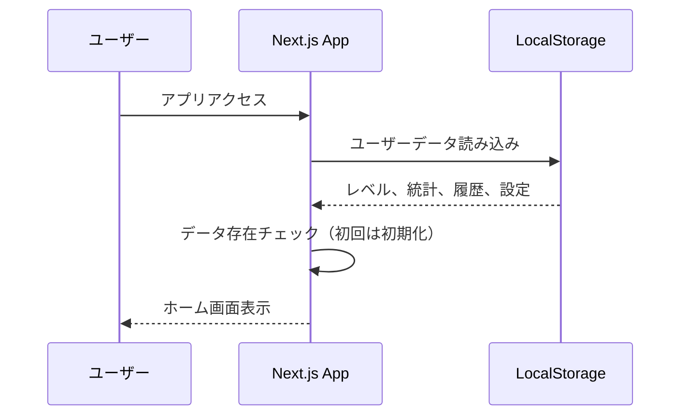
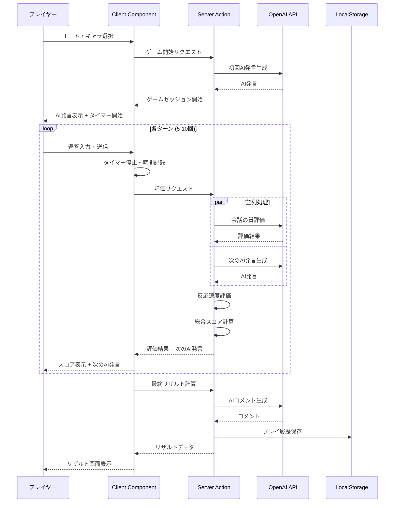

# アーキテクチャ設計書

## 概要

このドキュメントでは、会話ダッシュの技術アーキテクチャ、処理フロー、システム構成、API 設計について定義します。

---

## システムアーキテクチャ

### 全体構成図

```
┌──────────────────────────────────────────────────────────┐
│                     client (Next.js)                     │
│                                                          │
│  ┌──────────────┐   ┌──────────────┐   ┌─────────────┐   │
│  │  Frontend    │   │ Server       │   │ Client      │   │
│  │              │   │ Components   │   │ Components  │   │
│  │  (React)     │   │              │   │             │   │
│  └──────┬───────┘   └──────┬───────┘   └──────┬──────┘   │
│         │                  │                  │          │
│         └──────────────────┴──────────────────┘          │
│                            │                             │
└────────────────────────────┼─────────────────────────────┘
                             │
                    ┌────────┴────────┐
                    │                 │
          ┌─────────▼────────┐  ┌─────▼─────────┐
          │   Server Actions │  │  API Routes   │
          │   (Mutations)    │  │  (Webhooks)   │
          └─────────┬────────┘  └─────┬─────────┘
                    │                 │
        ┌───────────┴─────────────────┴──────────────┐
        │                                             │
┌────────────────────────────────┐  ┌────────────────────────┐
│     OpenAI API                 │  │   Local Storage        │
│     (GPT-4o-mini)              │  │                        │
│                                │  │  - ユーザーデータ        │
│  - 会話生成                     │  │  - プレイ履歴           │
│  - 評価                        │  │  - 称号・レベル          │
│  - コメント                     │  │  - ゲーム設定            │
└────────────────────────────────┘  └────────────────────────┘
```

### 技術スタック

| レイヤー       | 技術                          |
| -------------- | ----------------------------- |
| フロントエンド | Next.js 15, React, TypeScript |
| UI Framework   | Shadcn/ui, Tailwind CSS       |
| バックエンド   | Next.js Server Actions        |
| データ永続化   | LocalStorage / IndexedDB      |
| AI/ML          | OpenAI API (GPT-4o-mini)      |
| デプロイ       | Vercel                        |

---

## 処理フロー

### 1. アプリ起動フロー



### 2. ゲームプレイフロー

#### 全体フロー



#### 詳細フロー（1 ターンの処理）

```
1. ユーザー入力待機
   │
   ├─ タイマー開始（制限時間: 3-10秒）
   │
   ↓
2. ユーザー返答送信
   │
   ├─ タイマー停止
   ├─ 返答時間記録
   │
   ↓
3. Server Action 呼び出し
   │
   ├─ 反応速度スコア計算（同期）
   │  └─ calculateSpeedScore()
   │
   └─ 会話の質評価 + 次のAI発言生成（並列）
      │
      ├─ OpenAI API: 会話の質評価
      │  └─ calculateConversationQualityScore()
      │     - naturalness: 0-100
      │     - empathy: 0-100
      │     - topicExpansion: 0-100
      │     - emotion: 0-100
      │
      └─ OpenAI API: 次のAI発言生成
         └─ generateAIResponse()
   │
   ↓
4. 総合スコア計算
   │
   ├─ 反応速度(20%) + 会話の質(80%)
   ├─ グレード判定（S/A/B/C/D）
   ├─ コンボチェック
   │
   ↓
5. クライアントに返却
   │
   ├─ スコア表示（アニメーション）
   ├─ 次のAI発言表示
   ├─ コンボ演出（該当時）
   │
   ↓
6. 次のターンへ
```

---

## 📡 API 設計

### Server Actions

#### 1. `startGameSession`

ゲームセッションを開始し、初回の AI 発言を生成します。

```typescript
async function startGameSession(input: {
  mode: ModeId;
  character: CharacterId;
  settings: GameSettings;
}): Promise<GameSession> {
  // セッションID生成
  const sessionId = crypto.randomUUID();

  // 初回AI発言生成
  const initialMessage = await generateAIResponse(
    null, // 初回は返答なし
    input.character,
    []
  );

  // セッションデータ作成
  const session: GameSession = {
    id: sessionId,
    mode: input.mode,
    character: input.character,
    settings: input.settings,
    currentTurn: 0,
    maxTurns: input.settings.turns,
    conversationHistory: [
      {
        id: crypto.randomUUID(),
        sender: "ai",
        content: initialMessage,
        timestamp: new Date(),
      },
    ],
    combo: {
      count: 0,
      maxCombo: 0,
      threshold: 70,
      isActive: false,
    },
    aiMood: "neutral",
  };

  return session;
}
```

#### 2. `evaluateResponse`

プレイヤーの返答を評価し、次の AI 発言を生成します。

```typescript
async function evaluateResponse(input: {
  sessionId: string;
  playerMessage: string;
  responseTime: number;
  conversationHistory: Message[];
}): Promise<EvaluationResult> {
  const { playerMessage, responseTime, conversationHistory } = input;

  // 直前のAIメッセージを取得
  const lastAIMessage = conversationHistory
    .filter((m) => m.sender === "ai")
    .slice(-1)[0]?.content;

  // 並列処理: 評価 + 次のAI発言生成
  const [speedScore, qualityEvaluation, nextAIMessage] = await Promise.all([
    // 反応速度評価（同期処理だがPromiseでラップ）
    Promise.resolve(
      calculateSpeedScore(responseTime, input.session.settings.timeLimit)
    ),

    // 会話の質評価
    calculateConversationQualityScore(
      playerMessage,
      lastAIMessage,
      conversationHistory
    ),

    // 次のAI発言生成
    generateAIResponse(
      playerMessage,
      input.session.character,
      conversationHistory
    ),
  ]);

  // 総合スコア計算
  const finalScore = await calculateFinalScore(speedScore, qualityEvaluation);

  // コンボチェック
  const combo = checkCombo(finalScore.total, input.session.combo);
  const comboMessage = getComboMessage(combo.count);

  return {
    score: finalScore,
    nextAIMessage,
    combo,
    comboMessage,
    aiComment: qualityEvaluation.comment,
  };
}
```

#### 3. `finalizeSession`

ゲームセッションを終了し、最終リザルトを計算・保存します。

```typescript
async function finalizeSession(input: {
  sessionId: string;
  session: GameSession;
  allScores: ComprehensiveScore[];
}): Promise<FinalResult> {
  const { session, allScores } = input;

  // 平均スコア計算
  const averageTotal =
    allScores.reduce((sum, s) => sum + s.total, 0) / allScores.length;

  const averageBreakdown = {
    naturalness:
      allScores.reduce((sum, s) => sum + s.breakdown.naturalness, 0) /
      allScores.length,
    empathy:
      allScores.reduce((sum, s) => sum + s.breakdown.empathy, 0) /
      allScores.length,
    topicExpansion:
      allScores.reduce((sum, s) => sum + s.breakdown.topicExpansion, 0) /
      allScores.length,
    emotion:
      allScores.reduce((sum, s) => sum + s.breakdown.emotion, 0) /
      allScores.length,
  };

  // 最終グレード
  let grade: "S" | "A" | "B" | "C" | "D";
  if (averageTotal >= 90) grade = "S";
  else if (averageTotal >= 75) grade = "A";
  else if (averageTotal >= 60) grade = "B";
  else if (averageTotal >= 45) grade = "C";
  else grade = "D";

  // AIコメント生成
  const aiComment = await generateAIComment(
    {
      total: Math.round(averageTotal),
      speed: allScores.reduce((sum, s) => sum + s.speed, 0) / allScores.length,
      conversationQuality:
        allScores.reduce((sum, s) => sum + s.conversationQuality, 0) /
        allScores.length,
      breakdown: averageBreakdown,
      grade,
    },
    session.character,
    session.conversationHistory[session.conversationHistory.length - 1].content
  );

  // 経験値計算
  const experience = calculateExperience({
    total: Math.round(averageTotal),
    speed: 0,
    conversationQuality: 0,
    breakdown: averageBreakdown,
    grade,
  });

  // LocalStorageに保存
  await savePlayHistoryToLocal({
    sessionId: input.sessionId,
    mode: session.mode,
    character: session.character,
    averageScore: Math.round(averageTotal),
    breakdown: averageBreakdown,
    grade,
    maxCombo: session.combo.maxCombo,
    experience,
    playedAt: new Date(),
  });

  // 称号チェック
  const newAchievements = await checkAchievements();

  return {
    sessionId: input.sessionId,
    averageScore: Math.round(averageTotal),
    breakdown: averageBreakdown,
    grade,
    aiComment,
    maxCombo: session.combo.maxCombo,
    experience,
    newAchievements,
  };
}
```

### OpenAI API 呼び出し

#### 1. 会話生成

```typescript
async function generateAIResponse(
  playerMessage: string | null,
  character: Character,
  conversationHistory: Message[]
): Promise<string> {
  const systemPrompt = `
あなたは${character.name}です。
性格: ${character.description}

【会話のルール】
1. ${character.responseStyle}なスタイルで返答
2. 自然な会話を心がける
3. 適度に質問も入れる
4. 50文字以内で返答
5. 絵文字は控えめに（1-2個）
`;

  const messages = [
    { role: "system", content: systemPrompt },
    ...conversationHistory.map((m) => ({
      role: m.sender === "ai" ? "assistant" : "user",
      content: m.content,
    })),
  ];

  if (playerMessage) {
    messages.push({ role: "user", content: playerMessage });
  }

  const response = await openai.chat.completions.create({
    model: "gpt-4o-mini",
    messages,
    temperature: 0.8,
    max_tokens: 100,
  });

  return response.choices[0].message.content?.trim() || "...";
}
```

#### 2. 会話の質評価

（ai-evaluation-design.md を参照）

#### 3. AI コメント生成

（ai-evaluation-design.md を参照）

---

## 💾 ローカルストレージ設計

### データ構造

#### 1. `userData` - ユーザー情報

```typescript
type UserData = {
  id: string; // ユニークID（初回生成）
  name: string; // 表示名（オプション）
  level: number; // レベル
  experience: number; // 経験値
  createdAt: string; // 作成日時
  updatedAt: string; // 更新日時
};

// LocalStorage Key: "kaiwa-dash-user"
```

#### 2. `playHistory` - プレイ履歴

```typescript
type PlayHistory = {
  sessionId: string;
  mode: ModeId;
  character: CharacterId;
  averageScore: number; // 0-100
  breakdown: {
    naturalness: number;
    empathy: number;
    topicExpansion: number;
    emotion: number;
  };
  grade: "S" | "A" | "B" | "C" | "D";
  maxCombo: number;
  experience: number;
  playedAt: string; // ISO 8601
};

// LocalStorage Key: "kaiwa-dash-history"
// データ形式: PlayHistory[]
```

#### 3. `achievements` - 称号

```typescript
type UserAchievement = {
  achievementId: string; // 'speed-ninja', 'empathy-master', etc.
  unlockedAt: string; // ISO 8601
};

// LocalStorage Key: "kaiwa-dash-achievements"
// データ形式: UserAchievement[]
```

#### 4. `settings` - ゲーム設定

```typescript
type GameSettings = {
  defaultTurns: number; // デフォルトターン数（5/10/15）
  defaultTimeLimit: number; // デフォルト制限時間（3-10秒）
  inputMethod: "text" | "voice"; // 入力方法
  soundVolume: number; // 音量（0-100）
  vibrationEnabled: boolean; // バイブレーション
  notificationEnabled: boolean; // 通知
  notificationTime: string; // 通知時刻（HH:mm）
};

// LocalStorage Key: "kaiwa-dash-settings"
```

### データ操作関数

#### ユーザーデータの初期化・取得

```typescript
function initializeUser(): UserData {
  const existingUser = localStorage.getItem("kaiwa-dash-user");
  if (existingUser) {
    return JSON.parse(existingUser);
  }

  const newUser: UserData = {
    id: crypto.randomUUID(),
    name: "プレイヤー",
    level: 1,
    experience: 0,
    createdAt: new Date().toISOString(),
    updatedAt: new Date().toISOString(),
  };

  localStorage.setItem("kaiwa-dash-user", JSON.stringify(newUser));
  return newUser;
}

function updateUserLevel(experience: number): {
  level: number;
  isLevelUp: boolean;
} {
  const userData = initializeUser();
  const oldLevel = userData.level;

  // レベル計算（100XPごとにレベルアップ）
  const newLevel = Math.floor(experience / 100) + 1;
  const isLevelUp = newLevel > oldLevel;

  userData.level = newLevel;
  userData.experience = experience;
  userData.updatedAt = new Date().toISOString();

  localStorage.setItem("kaiwa-dash-user", JSON.stringify(userData));

  return { level: newLevel, isLevelUp };
}
```

#### プレイ履歴の保存・取得

```typescript
function savePlayHistoryToLocal(playData: PlayHistory): void {
  const history = getPlayHistory();
  history.unshift(playData); // 新しいものを先頭に

  // 最大100件まで保存（メモリ節約）
  const trimmedHistory = history.slice(0, 100);

  localStorage.setItem("kaiwa-dash-history", JSON.stringify(trimmedHistory));
}

function getPlayHistory(): PlayHistory[] {
  const stored = localStorage.getItem("kaiwa-dash-history");
  return stored ? JSON.parse(stored) : [];
}

function getPlayHistoryByMode(mode: ModeId): PlayHistory[] {
  const history = getPlayHistory();
  return history.filter((h) => h.mode === mode);
}
```

#### 称号の管理

```typescript
function unlockAchievement(achievementId: string): boolean {
  const achievements = getAchievements();

  // 既に解除済みかチェック
  if (achievements.some((a) => a.achievementId === achievementId)) {
    return false;
  }

  achievements.push({
    achievementId,
    unlockedAt: new Date().toISOString(),
  });

  localStorage.setItem("kaiwa-dash-achievements", JSON.stringify(achievements));
  return true; // 新規解除
}

function getAchievements(): UserAchievement[] {
  const stored = localStorage.getItem("kaiwa-dash-achievements");
  return stored ? JSON.parse(stored) : [];
}
```

### データのエクスポート・インポート

```typescript
// 全データをJSONでエクスポート
function exportAllData(): string {
  const data = {
    user: localStorage.getItem("kaiwa-dash-user"),
    history: localStorage.getItem("kaiwa-dash-history"),
    achievements: localStorage.getItem("kaiwa-dash-achievements"),
    settings: localStorage.getItem("kaiwa-dash-settings"),
    exportedAt: new Date().toISOString(),
  };

  return JSON.stringify(data, null, 2);
}

// JSONデータをインポート
function importAllData(jsonData: string): void {
  try {
    const data = JSON.parse(jsonData);

    if (data.user) localStorage.setItem("kaiwa-dash-user", data.user);
    if (data.history) localStorage.setItem("kaiwa-dash-history", data.history);
    if (data.achievements)
      localStorage.setItem("kaiwa-dash-achievements", data.achievements);
    if (data.settings)
      localStorage.setItem("kaiwa-dash-settings", data.settings);

    alert("データのインポートが完了しました");
    window.location.reload();
  } catch (error) {
    console.error("Import failed:", error);
    alert("データのインポートに失敗しました");
  }
}
```

### データのリセット

```typescript
function resetAllData(): void {
  if (confirm("すべてのデータをリセットしますか？この操作は取り消せません。")) {
    localStorage.removeItem("kaiwa-dash-user");
    localStorage.removeItem("kaiwa-dash-history");
    localStorage.removeItem("kaiwa-dash-achievements");
    // 設定は保持

    alert("データがリセットされました");
    window.location.reload();
  }
}
```

---

## 🎨 状態管理

### Client Component の状態

```typescript
type GameState = {
  // セッション情報
  sessionId: string;
  mode: ModeId;
  character: Character;
  settings: GameSettings;

  // ターン情報
  currentTurn: number;
  maxTurns: number;

  // 会話履歴
  conversationHistory: Message[];

  // タイマー
  timeLimit: number;
  remainingTime: number;
  timerStartedAt: Date | null;

  // スコア
  turnScores: ComprehensiveScore[];
  currentTurnScore: ComprehensiveScore | null;

  // コンボ
  combo: ComboState;

  // UI状態
  isLoading: boolean;
  isTimerActive: boolean;
  showScoreAnimation: boolean;
  aiMood: "happy" | "neutral" | "bored" | "surprised";
};
```

### LocalStorage の利用

ゲーム設定などの非重要データはローカルストレージに保存します。

```typescript
// 設定の保存
function saveSettings(settings: GameSettings) {
  localStorage.setItem("kaiwa-dash-settings", JSON.stringify(settings));
}

// 設定の読み込み
function loadSettings(): GameSettings {
  const stored = localStorage.getItem("kaiwa-dash-settings");
  if (stored) {
    return JSON.parse(stored);
  }
  return defaultSettings;
}
```

---

## ⚡ パフォーマンス最適化

### 1. API 呼び出しの最適化

```typescript
// 並列処理で評価と次のAI発言を同時取得
const [qualityEvaluation, nextAIMessage] = await Promise.all([
  calculateConversationQualityScore(playerMessage, aiMessage, history),
  generateAIResponse(playerMessage, character, history),
]);
```

### 2. キャッシュ戦略

```typescript
// キャラクター設定をキャッシュ
const characterCache = new Map<CharacterId, Character>();

function getCharacter(id: CharacterId): Character {
  if (!characterCache.has(id)) {
    characterCache.set(id, loadCharacterConfig(id));
  }
  return characterCache.get(id)!;
}
```

### 3. Streaming UI

リアルタイムのフィードバックのために、Streaming を活用します。

```typescript
// AI発言のストリーミング
async function* streamAIResponse(
  playerMessage: string,
  character: Character,
  history: Message[]
) {
  const stream = await openai.chat.completions.create({
    model: "gpt-4o-mini",
    messages: buildMessages(playerMessage, character, history),
    stream: true,
  });

  for await (const chunk of stream) {
    const content = chunk.choices[0]?.delta?.content;
    if (content) {
      yield content;
    }
  }
}
```

---

## 🧪 テスト戦略

### 1. Unit Tests (Vitest)

```typescript
// 評価ロジックのテスト
describe("calculateSpeedScore", () => {
  it("should return 100 for responses within 50% of time limit", () => {
    expect(calculateSpeedScore(2, 5)).toBe(100);
  });

  it("should return 20 for timeout", () => {
    expect(calculateSpeedScore(6, 5)).toBe(20);
  });
});
```

### 2. Integration Tests (React Testing Library)

```typescript
// コンポーネントのテスト
describe("ConversationPlay", () => {
  it("should start timer when AI message is displayed", () => {
    render(<ConversationPlay session={mockSession} />);
    expect(screen.getByText(/⏱️/)).toBeInTheDocument();
  });

  it("should submit response and show score", async () => {
    render(<ConversationPlay session={mockSession} />);
    const input = screen.getByPlaceholderText("あなたの返答を入力...");
    fireEvent.change(input, { target: { value: "test message" } });
    fireEvent.click(screen.getByText("送信"));

    await waitFor(() => {
      expect(screen.getByText(/スコア/)).toBeInTheDocument();
    });
  });
});
```

### 3. E2E Tests (Playwright)

```typescript
// 完全なゲームフローのテスト
test("should complete a full game session", async ({ page }) => {
  await page.goto("/");
  await page.click('text="プレイ開始"');
  await page.click('text="雑談スプリント"');
  await page.click('text="真面目くん"');
  await page.click('text="スタート！"');

  // ゲームプレイ
  for (let i = 0; i < 5; i++) {
    await page.fill(
      'input[placeholder="あなたの返答を入力..."]',
      "test message"
    );
    await page.click('button:has-text("送信")');
    await page.waitForSelector('text="スコア"');
  }

  // リザルト確認
  await page.waitForSelector('text="リザルト"');
  expect(await page.textContent("h1")).toContain("ランク");
});
```

---

## 🚀 デプロイ戦略

### Vercel デプロイ

```bash
# 環境変数設定（Vercel Dashboard）
NEXT_PUBLIC_SUPABASE_URL=your_supabase_url
NEXT_PUBLIC_SUPABASE_ANON_KEY=your_supabase_anon_key
OPENAI_API_KEY=your_openai_api_key

# デプロイ
vercel --prod
```

### 環境別設定

| 環境        | URL                              | 用途                |
| ----------- | -------------------------------- | ------------------- |
| Production  | https://kaiwa-dash.vercel.app    | 本番環境            |
| Preview     | https://kaiwa-dash-\*.vercel.app | PR ごとのプレビュー |
| Development | http://localhost:3000            | ローカル開発        |

---

## 📊 モニタリング

### 1. エラートラッキング

```typescript
// Sentry統合（オプション）
import * as Sentry from "@sentry/nextjs";

Sentry.init({
  dsn: process.env.SENTRY_DSN,
  environment: process.env.NODE_ENV,
});

// エラーハンドリング
try {
  await evaluateResponse(input);
} catch (error) {
  Sentry.captureException(error);
  throw error;
}
```

### 2. パフォーマンスモニタリング

```typescript
// カスタムメトリクス
export async function evaluateResponse(input: EvaluationInput) {
  const start = Date.now();

  try {
    const result = await evaluateResponseInternal(input);
    const duration = Date.now() - start;

    // メトリクス記録
    console.log(`[PERF] evaluateResponse took ${duration}ms`);

    return result;
  } catch (error) {
    const duration = Date.now() - start;
    console.error(`[PERF] evaluateResponse failed after ${duration}ms`);
    throw error;
  }
}
```
